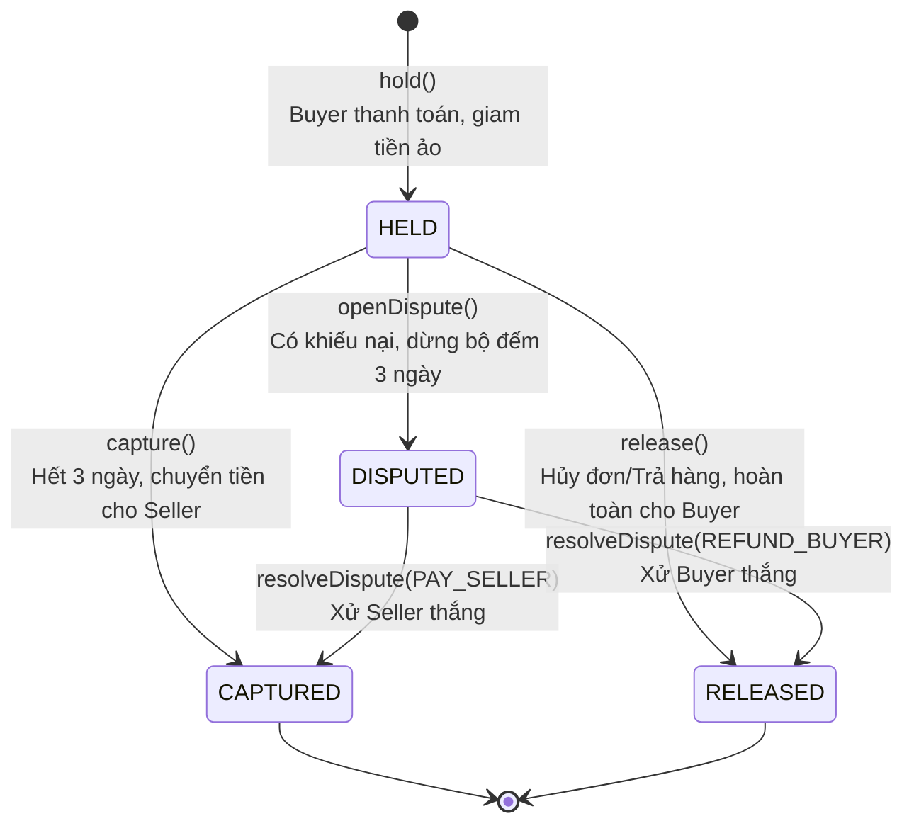
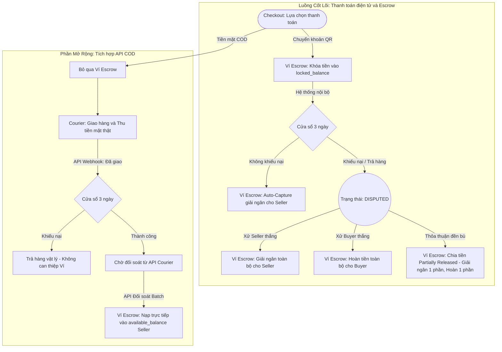
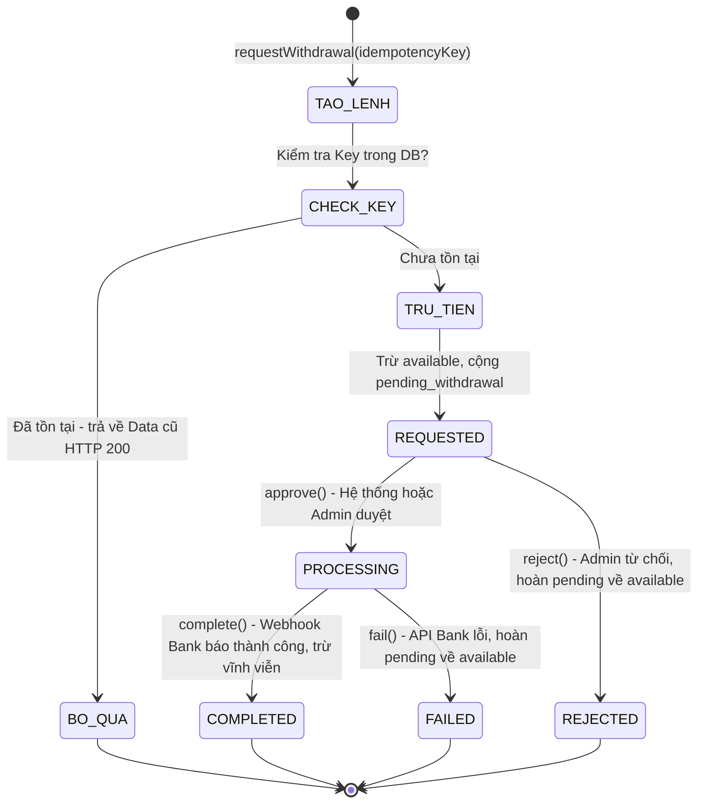
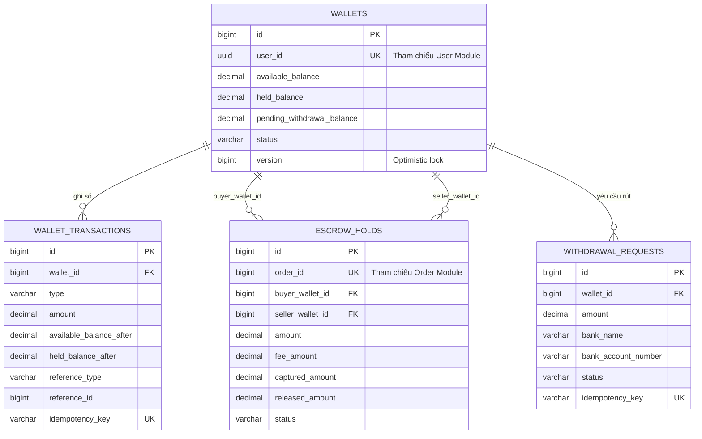

# Tài liệu kiến trúc module Wallet (Ví / Escrow)

**Dự án:** Moldy Market — Marketplace C2C Đồ cũ

**Module:** `com.moldy.moldymarket.wallet`

**Định vị:** Quản lý dòng tiền nội bộ (Internal Ledger), Giữ tiền đảm bảo (Escrow), và Rút tiền.

---

## 1. Vị trí module trong kiến trúc Modulith

Dự án tổ chức theo **Modulith** (đơn khối nhưng chia module rõ ràng theo domain). `wallet` là một module độc lập, quản lý sổ cái kỹ thuật số và không phụ thuộc vào các thư viện tích hợp ngân hàng bên ngoài.

```
com.moldy.moldymarket
├── user/            → User, UserProfile
├── order/           → Order, ShippingSimulator
├── payment/         → Xử lý Webhook ngân hàng, sinh mã QR (Mới)
├── wallet/          → Quản lý số dư, sổ cái, escrow (Module này)
└── common/          → AppException, ErrorCode, GlobalExceptionHandler
```

### Nguyên tắc biên module (Module Boundary)

| Được phép | Không được phép |
|---|---|
| Lưu `userId` (UUID), `orderId` (Long) dưới dạng kiểu dữ liệu thô. | Có field `User` hoặc `Order` (JPA relation trỏ sang module khác). |
| Lắng nghe sự kiện (`PaymentSuccessEvent`) từ module `payment` để nạp tiền ẩn và khóa Escrow. | Viết code gọi API VNPay, SePay hay xử lý Webhook bên trong module `wallet`. |
| Module khác gọi `EscrowService` qua method công khai. | Module khác gọi thẳng `WalletRepository` hoặc sửa trực tiếp DB của `wallet`. |

---

## 2. Bản chất lưu trữ tiền & Giải quyết bài toán gì?

Hệ thống Ví trong Moldy Market **không phải** là một Ví điện tử (E-Wallet) theo luật định, mà là một **Số dư tài khoản sàn (Internal Ledger)**.

- **Tiền thật** nằm hoàn toàn trong tài khoản ngân hàng công ty.
- **Tiền ảo** nằm trong bảng `WALLETS`. Tổng số dư ảo luôn bằng số dư tiền mặt thật.

### 2.1. Tại sao không chuyển thẳng tiền cho Seller qua ngân hàng?

- **Tối ưu chi phí**: Gom nhiều khoản tiền lẻ của Seller thành số dư ảo. Khi Seller rút 1 lần, nền tảng chỉ chịu 1 lần phí chuyển khoản.
- **Khả năng chịu lỗi**: Giao dịch nội bộ thành công trong 1ms. Đẩy rủi ro lỗi mạng/bảo trì của API ngân hàng sang luồng "Rút tiền" bất đồng bộ, bảo vệ luồng hoàn tất đơn hàng cốt lõi.
- **Quản trị rủi ro**: Dễ dàng trừ tiền phạt, cấn trừ công nợ, thu phí sàn, hoặc chia tiền (Split) đền bù khi tranh chấp.
- **Thanh khoản nội bộ**: Khuyến khích user dùng tiền bán được để mua món đồ khác trên sàn.

### 2.2. Các quyết định thiết kế (Design Decisions)

- **Không có chức năng Nạp tiền tự do (Top-up)**: Để tránh bị xếp vào loại hình Tổ chức trung gian thanh toán (đòi hỏi giấy phép NHNN, KYC). Tiền chỉ vào ví qua doanh thu bán hàng, hoàn trả (refund), hoặc nạp ẩn khi thanh toán đơn.
- **Chống rò rỉ hàm Setter ID**: Tránh dùng `@Data` hoặc `@Setter` toàn cục trên các Entity. Việc để lộ `setId()` của JPA Entity có thể phá vỡ tính bất biến và toàn vẹn dữ liệu. Chỉ dùng `@Getter` cho khóa chính.

---

## 3. Luồng hoạt động của Wallet

### 3.1. Vòng đời Escrow (Giữ tiền đảm bảo)



### 3.2. Luồng tiền — Cốt lõi & Mở rộng (COD)



### 3.3. Luồng Rút tiền & Cơ chế Idempotency

Chống request trùng lặp (double-click, retry do mạng lag) bằng Idempotency Key.



---

## 4. Thiết kế Database

### 4.1. Sơ đồ Quan hệ (ERD)



### 4.2. Cấu trúc bảng (Tables)

**Bảng `wallets`** (Tài khoản ví ảo)

| Column | Type | Ghi chú |
|---|---|---|
| `id` | `BIGINT` | PK (Không expose ra API). |
| `user_id` | `UUID` | Khớp `User.id`, `UNIQUE`. |
| `available_balance` | `DECIMAL(19,2)` | Số dư khả dụng. |
| `held_balance` | `DECIMAL(19,2)` | Số tiền bị đóng băng chờ giao hàng. |
| `pending_withdrawal_balance` | `DECIMAL(19,2)` | Đang chờ chuyển khoản thật. |
| `version` | `BIGINT` | Optimistic Locking. |

**Bảng `wallet_transactions`** (Sổ cái — bất biến)

| Column | Type | Ghi chú |
|---|---|---|
| `id` | `BIGINT` | PK |
| `wallet_id` | `BIGINT` | Tham chiếu `wallets`. |
| `type` | `VARCHAR(30)` | `DEPOSIT`, `HOLD`, `CAPTURE`, `RELEASE`, `WITHDRAWAL`... |
| `amount` | `DECIMAL(19,2)` | Luôn dương. `type` quyết định cộng/trừ. |
| `available_balance_after` | `DECIMAL(19,2)` | Phục vụ audit. |
| `held_balance_after` | `DECIMAL(19,2)` | Phục vụ audit. |
| `idempotency_key` | `VARCHAR(100)` | `UNIQUE INDEX`. Chống xử lý trùng. |

**Bảng `escrow_holds`** (Lưu thông tin giữ tiền)

| Column | Type | Ghi chú |
|---|---|---|
| `order_id` | `BIGINT` | Khớp `Order.id`, `UNIQUE`. |
| `buyer_wallet_id` | `BIGINT` | Ví bị trừ tiền. |
| `seller_wallet_id` | `BIGINT` | Ví chờ nhận tiền. |
| `amount` | `DECIMAL(19,2)` | Tổng tiền giam ban đầu. |
| `captured_amount` | `DECIMAL(19,2)` | Số tiền giải ngân cho Seller. |
| `released_amount` | `DECIMAL(19,2)` | Số tiền hoàn cho Buyer. |
| `status` | `VARCHAR(20)` | `HELD`, `CAPTURED`, `RELEASED`, `PARTIALLY_RELEASED`, `DISPUTED`. |

**Bảng `withdrawal_requests`** (Yêu cầu rút tiền)

| Column | Type | Ghi chú |
|---|---|---|
| `amount` | `DECIMAL(19,2)` | Số tiền rút thật. |
| `bank_account_number` | `VARCHAR(50)` | Số tài khoản ngân hàng liên kết. |
| `status` | `VARCHAR(20)` | `REQUESTED`, `PROCESSING`, `COMPLETED`, `FAILED`. |
| `idempotency_key` | `VARCHAR(100)` | `UNIQUE INDEX`. Chống double-click. |

---

## 5. Danh sách API & Giao tiếp sự kiện

### 5.1. REST API

| Method | Endpoint | Chức năng |
|---|---|---|
| `GET` | `/api/wallets/{userId}/balance` | Xem số dư ví |
| `POST` | `/api/withdrawals` | Tạo yêu cầu rút tiền (Cần Idempotency Key) |
| `PATCH` | `/api/withdrawals/{id}/approve` | Duyệt yêu cầu rút (Chỉ Admin) |
| `PATCH` | `/api/withdrawals/{id}/complete` | Xác nhận chuyển khoản ngoài thành công |

### 5.2. Giao tiếp sự kiện (Modulith Events — "The Invisible Top-up")

Vì module Wallet không có API `POST /deposit` (nạp tiền), dòng tiền thanh toán đơn hàng chảy vào hệ thống thông qua Event:

1. Module `payment` nhận Webhook từ ngân hàng/SePay → publish `PaymentSuccessEvent`.
2. Listener trong module `wallet` hứng event, thực thi 2 lệnh trong **1 Transaction CSDL**:
    - `walletService.deposit()`: Nạp ẩn tiền thật vào `available_balance`.
    - `escrowService.hold()`: Trừ ngay sang `held_balance` để khóa lại cho đơn hàng.

---

## 6. Xử lý đồng thời (Concurrency Rules)

- **Transaction cốt lõi**: Bất kỳ thao tác thay đổi balance nào bắt buộc kèm 1 lệnh `INSERT` vào `wallet_transactions` trong cùng `@Transactional`.
- **Pessimistic Locking**: Vì lệnh giải ngân sửa cả ví Buyer và Seller cùng lúc, bắt buộc dùng `SELECT ... FOR UPDATE` trên CSDL.
- **Thứ tự Lock (Deadlock Prevention)**: Khi lock nhiều ví cùng lúc, phải sort ID của ví theo thứ tự tăng dần trước khi thực thi Lock.

---

## 7. Mã lỗi (ErrorCode)

| Mã | HTTP Status | Ý nghĩa |
|---|---|---|
| `WALLET_NOT_FOUND` | 404 | Không tìm thấy ví |
| `WALLET_INACTIVE` | 409 | Ví đang bị đóng băng (FROZEN) |
| `INSUFFICIENT_BALANCE` | 422 | Không đủ số dư khả dụng |
| `ESCROW_NOT_FOUND` | 404 | Không tìm thấy hold cho đơn hàng này |
| `INVALID_ESCROW_STATE` | 409 | Chuyển trạng thái sai quy tắc vòng đời Escrow |

---

## Ghi chú đối chiếu với code hiện tại

Bản thiết kế này mô tả dòng tiền vào ví qua **event ẩn** (`PaymentSuccessEvent` → `deposit()` → `hold()` trong cùng 1 transaction). Code hiện tại (`WalletService`/`EscrowService` đã build) đang để `hold()` trừ thẳng từ `available_balance` mà **chưa có bước `deposit()` đứng trước** để tạo dòng ledger `DEPOSIT` riêng biệt. Nếu muốn khớp đúng thiết kế trong tài liệu này (để có dấu vết audit "tiền vào hệ thống" tách bạch với "tiền bị khóa cho đơn hàng"), cần bổ sung:
- Một `ApplicationModuleListener` trong `wallet` module lắng nghe `PaymentSuccessEvent` từ module `payment`.
- Khôi phục lại `WalletService.deposit()` dạng **nội bộ, không expose REST API** — chỉ gọi được từ listener này.
