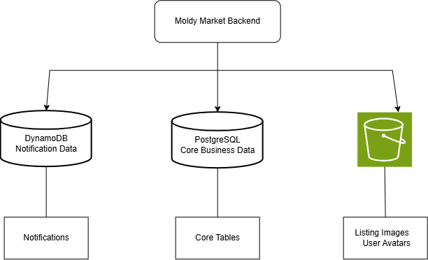
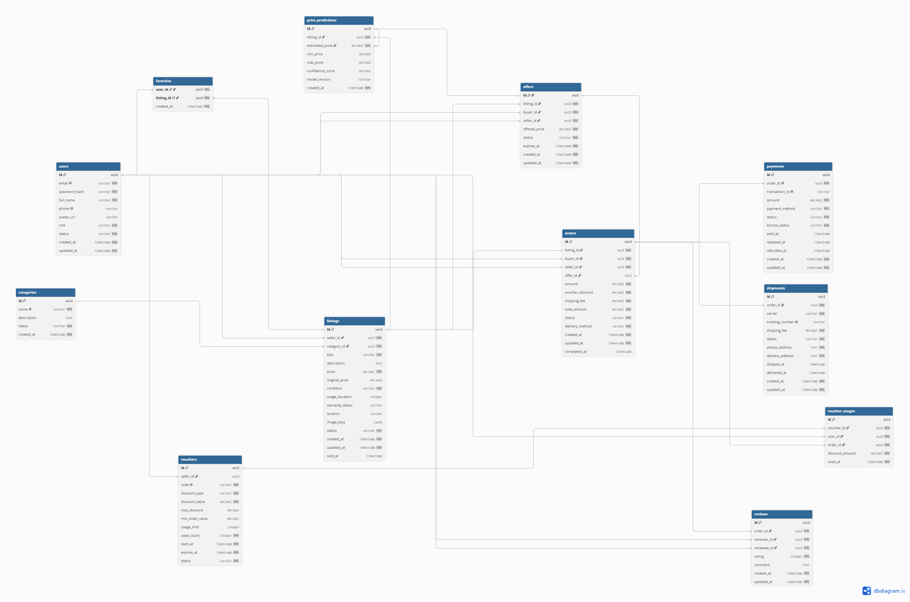

# Moldy Market — Database Design Document

## 1. Tổng quan

Moldy Market sử dụng kiến trúc lưu trữ dữ liệu kết hợp giữa PostgreSQL, DynamoDB và Amazon S3. Mỗi hệ quản trị được sử dụng cho một nhóm dữ liệu có đặc điểm và workload khác nhau.

### Mục tiêu

* Đảm bảo tính toàn vẹn cho dữ liệu nghiệp vụ.
* Hỗ trợ transaction cho các nghiệp vụ quan trọng như Order và Payment.
* Tách biệt workload của Notification khỏi dữ liệu nghiệp vụ chính.
* Lưu trữ hình ảnh hiệu quả mà không làm tăng kích thước database.
* Cho phép từng loại storage được mở rộng độc lập.

---

## 2. Kiến trúc Database


### 2.1 PostgreSQL

Lưu trữ dữ liệu nghiệp vụ cốt lõi của hệ thống. PostgreSQL được sử dụng cho các dữ liệu yêu cầu tính nhất quán, quan hệ giữa các entity và transaction.

#### Dữ liệu lưu trữ

1. `users` — Thông tin người dùng
2. `categories` — Danh mục sản phẩm
3. `listings` — Thông tin sản phẩm đăng bán
4. `favorites` — Danh sách sản phẩm yêu thích
5. `offers` — Các đề nghị và thương lượng giá
6. `orders` — Thông tin đơn hàng
7. `payments` — Thông tin thanh toán
8. `shipments` — Thông tin vận chuyển
9. `vouchers` — Thông tin voucher
10. `voucher_usages` — Lịch sử sử dụng voucher
11. `reviews` — Đánh giá giữa người mua và người bán
12. `price_predictions` — Kết quả dự đoán giá

### 2.2 DynamoDB

Lưu trữ dữ liệu Notification. Notification được tách khỏi PostgreSQL để tránh workload thông báo ảnh hưởng trực tiếp đến các nghiệp vụ quan trọng như Order và Payment.

DynamoDB phù hợp với Notification vì các thao tác chính thường là:

* Tạo notification.
* Lấy danh sách notification của user.
* Đánh dấu notification đã đọc.
* Xóa hoặc hết hạn notification.

### 2.3 Amazon S3

Lưu trữ các file hình ảnh của hệ thống như hình ảnh sản phẩm và ảnh đại diện người dùng.

Database chỉ lưu `object_key` hoặc URL tham chiếu đến file trên S3 thay vì lưu trực tiếp binary image.

### Lý do sử dụng nhiều loại Storage

#### PostgreSQL

Được sử dụng cho dữ liệu có quan hệ và yêu cầu transaction.

```text
User -> Listing -> Offer -> Order -> Payment -> Shipment
```

Các nghiệp vụ này cần đảm bảo tính nhất quán dữ liệu.

#### DynamoDB

Được sử dụng cho Notification vì:

* Workload đơn giản.
* Truy cập chủ yếu theo user.
* Không cần join.
* Có thể tăng nhanh theo số lượng notification.
* Có thể scale độc lập với PostgreSQL.

#### S3

Được sử dụng cho image vì:

* Phù hợp lưu binary object.
* Không làm database phình to.
* Hỗ trợ khả năng mở rộng lớn.

---

# 3. PostgreSQL Schema

## 3.1 `users`

Lưu thông tin tài khoản và trạng thái của người dùng trong hệ thống.

| Column          | Type        | Constraint       | Mô tả                                             |
| --------------- | ----------- | ---------------- | ------------------------------------------------- |
| `id`            | UUID/BIGINT | PK               | Mã người dùng                                     |
| `email`         | VARCHAR     | UNIQUE, NOT NULL | Email đăng nhập                                   |
| `password_hash` | VARCHAR     | NOT NULL         | Mật khẩu đã được mã hóa                           |
| `full_name`     | VARCHAR     | NOT NULL         | Họ và tên                                         |
| `phone`         | VARCHAR     | UNIQUE           | Số điện thoại                                     |
| `avatar_url`    | VARCHAR     | NULL             | URL hoặc object key của ảnh đại diện              |
| `role`          | VARCHAR     | NOT NULL         | Vai trò của người dùng (`ADMIN`, `USER`, `STAFF`) |
| `status`        | VARCHAR     | NOT NULL         | Trạng thái tài khoản (`ACTIVE`, `BLOCKED`)        |
| `created_at`    | TIMESTAMP   | NOT NULL         | Thời điểm tạo                                     |
| `updated_at`    | TIMESTAMP   | NOT NULL         | Thời điểm cập nhật                                |

---

## 3.2 `categories`

Lưu danh mục dùng để phân loại các sản phẩm được đăng trên hệ thống.

| Column        | Type        | Constraint       | Mô tả               |
| ------------- | ----------- | ---------------- | ------------------- |
| `id`          | UUID/BIGINT | PK               | Mã danh mục         |
| `name`        | VARCHAR     | UNIQUE, NOT NULL | Tên danh mục        |
| `description` | TEXT        | NULL             | Mô tả danh mục      |
| `status`      | VARCHAR     | NOT NULL         | Trạng thái danh mục |
| `created_at`  | TIMESTAMP   | NOT NULL         | Thời điểm tạo       |

---

## 3.3 `listings`

Lưu thông tin các sản phẩm được người bán đăng bán trên hệ thống.

| Column            | Type        | Constraint           | Mô tả                                                       |
| ----------------- | ----------- | -------------------- | ----------------------------------------------------------- |
| `id`              | UUID/BIGINT | PK                   | Mã sản phẩm                                                 |
| `seller_id`       | UUID/BIGINT | FK → `users.id`      | Người bán                                                   |
| `category_id`     | UUID/BIGINT | FK → `categories.id` | Danh mục                                                    |
| `title`           | VARCHAR     | NOT NULL             | Tiêu đề sản phẩm                                            |
| `description`     | TEXT        | NULL                 | Mô tả sản phẩm                                              |
| `price`           | DECIMAL     | NOT NULL             | Giá bán hiện tại                                            |
| `original_price`  | DECIMAL     | NULL                 | Giá gốc                                                     |
| `condition`       | VARCHAR     | NOT NULL             | Tình trạng sản phẩm                                         |
| `usage_duration`  | INTEGER     | NULL                 | Thời gian đã sử dụng                                        |
| `warranty_status` | VARCHAR     | NULL                 | Thông tin bảo hành                                          |
| `location`        | VARCHAR     | NULL                 | Khu vực của người bán                                       |
| `image_keys`      | JSONB       | NULL                 | Danh sách object key của hình ảnh trên S3                   |
| `status`          | VARCHAR     | NOT NULL             | Trạng thái sản phẩm (`ACTIVE`, `SOLD`, `HIDDEN`, `EXPIRED`) |
| `created_at`      | TIMESTAMP   | NOT NULL             | Thời điểm đăng                                              |
| `updated_at`      | TIMESTAMP   | NOT NULL             | Thời điểm cập nhật                                          |
| `sold_at`         | TIMESTAMP   | NULL                 | Thời điểm bán                                               |

Ví dụ `image_keys`:

```json
[
  "listings/123/image-01.jpg",
  "listings/123/image-02.jpg"
]
```

---

## 3.4 `favorites`

Lưu danh sách các sản phẩm mà người dùng đã thêm vào yêu thích.

| Column       | Type        | Constraint             | Mô tả          |
| ------------ | ----------- | ---------------------- | -------------- |
| `user_id`    | UUID/BIGINT | PK, FK → `users.id`    | Người dùng     |
| `listing_id` | UUID/BIGINT | PK, FK → `listings.id` | Sản phẩm       |
| `created_at` | TIMESTAMP   | NOT NULL               | Thời điểm thêm |

### Primary Key

```text
(user_id, listing_id)
```

**Mục đích:** Đảm bảo một user không thể thêm cùng một listing vào favorites nhiều lần.

---

## 3.5 `offers`

Lưu các đề nghị giá giữa người mua và người bán trong quá trình thương lượng.

| Column          | Type        | Constraint         | Mô tả                                                                                       |
| --------------- | ----------- | ------------------ | ------------------------------------------------------------------------------------------- |
| `id`            | UUID/BIGINT | PK                 | Mã đề nghị                                                                                  |
| `listing_id`    | UUID/BIGINT | FK → `listings.id` | Sản phẩm được thương lượng                                                                  |
| `buyer_id`      | UUID/BIGINT | FK → `users.id`    | Người mua                                                                                   |
| `seller_id`     | UUID/BIGINT | FK → `users.id`    | Người bán                                                                                   |
| `offered_price` | DECIMAL     | NOT NULL           | Giá được đề nghị                                                                            |
| `status`        | VARCHAR     | NOT NULL           | Trạng thái đề nghị (`PENDING`, `ACCEPTED`, `REJECTED`, `COUNTERED`, `EXPIRED`, `CANCELLED`) |
| `expires_at`    | TIMESTAMP   | NOT NULL           | Thời điểm hết hạn                                                                           |
| `created_at`    | TIMESTAMP   | NOT NULL           | Thời điểm tạo                                                                               |
| `updated_at`    | TIMESTAMP   | NOT NULL           | Thời điểm cập nhật                                                                          |

### Business Rule
`buyer_id` phải khác `seller_id` vì không thể tự gửi offer cho chính mình.

Offer có thời gian hiệu lực được xác định bởi `expires_at`.

Sau thời điểm này, offer có thể chuyển sang trạng thái `EXPIRED`.

---

## 3.6 `orders`

Lưu thông tin giao dịch giữa buyer và seller sau khi một listing được mua hoặc một offer được chấp nhận.

| Column             | Type        | Constraint             | Mô tả                                        |
| ------------------ | ----------- | ---------------------- | -------------------------------------------- |
| `id`               | UUID/BIGINT | PK                     | Mã đơn hàng                                  |
| `listing_id`       | UUID/BIGINT | FK → `listings.id`     | Sản phẩm                                     |
| `buyer_id`         | UUID/BIGINT | FK → `users.id`        | Người mua                                    |
| `seller_id`        | UUID/BIGINT | FK → `users.id`        | Người bán                                    |
| `offer_id`         | UUID/BIGINT | FK → `offers.id`, NULL | Offer được sử dụng                           |
| `amount`           | DECIMAL     | NOT NULL               | Giá sản phẩm                                 |
| `voucher_discount` | DECIMAL     | DEFAULT 0              | Số tiền được giảm                            |
| `shipping_fee`     | DECIMAL     | DEFAULT 0              | Phí vận chuyển                               |
| `total_amount`     | DECIMAL     | NOT NULL               | Tổng tiền                                    |
| `status`           | VARCHAR     | NOT NULL               | Trạng thái đơn hàng                          |
| `delivery_method`  | VARCHAR     | NOT NULL               | Phương thức nhận hàng (`SHIPPING`, `MEETUP`) |
| `created_at`       | TIMESTAMP   | NOT NULL               | Thời điểm tạo                                |
| `updated_at`       | TIMESTAMP   | NOT NULL               | Thời điểm cập nhật                           |
| `completed_at`     | TIMESTAMP   | NULL                   | Thời điểm hoàn tất                           |

---

## 3.7 `payments`

Lưu thông tin thanh toán của đơn hàng và trạng thái tiền trong cơ chế escrow.

| Column           | Type        | Constraint       | Mô tả                                                          |
| ---------------- | ----------- | ---------------- | -------------------------------------------------------------- |
| `id`             | UUID/BIGINT | PK               | Mã thanh toán                                                  |
| `order_id`       | UUID/BIGINT | FK → `orders.id` | Đơn hàng                                                       |
| `transaction_id` | VARCHAR     | UNIQUE           | Mã giao dịch của cổng thanh toán                               |
| `amount`         | DECIMAL     | NOT NULL         | Số tiền thanh toán                                             |
| `payment_method` | VARCHAR     | NOT NULL         | Phương thức thanh toán (`VNPAY`, `MOMO`)                       |
| `status`         | VARCHAR     | NOT NULL         | Trạng thái thanh toán (`PENDING`, `SUCCESS`, `FAILED`)         |
| `escrow_status`  | VARCHAR     | NOT NULL         | Trạng thái escrow (`HELD`, `RELEASED`, `REFUNDED`, `DISPUTED`) |
| `paid_at`        | TIMESTAMP   | NULL             | Thời điểm thanh toán                                           |
| `released_at`    | TIMESTAMP   | NULL             | Thời điểm giải ngân                                            |
| `refunded_at`    | TIMESTAMP   | NULL             | Thời điểm hoàn tiền                                            |
| `created_at`     | TIMESTAMP   | NOT NULL         | Thời điểm tạo                                                  |
| `updated_at`     | TIMESTAMP   | NOT NULL         | Thời điểm cập nhật                                             |

---

## 3.8 `shipments`

Lưu thông tin vận chuyển và trạng thái giao hàng của đơn hàng.

| Column             | Type        | Constraint       | Mô tả                                |
| ------------------ | ----------- | ---------------- | ------------------------------------ |
| `id`               | UUID/BIGINT | PK               | Mã vận chuyển                        |
| `order_id`         | UUID/BIGINT | FK → `orders.id` | Đơn hàng                             |
| `carrier`          | VARCHAR     | NOT NULL         | Đơn vị vận chuyển                    |
| `tracking_number`  | VARCHAR     | UNIQUE           | Mã vận đơn                           |
| `shipping_fee`     | DECIMAL     | NOT NULL         | Phí vận chuyển                       |
| `status`           | VARCHAR     | NOT NULL         | Trạng thái vận chuyển                |
| `pickup_address`   | TEXT        | NOT NULL         | Địa chỉ lấy hàng                     |
| `delivery_address` | TEXT        | NOT NULL         | Địa chỉ nhận hàng                    |
| `shipped_at`       | TIMESTAMP   | NULL             | Thời điểm giao cho đơn vị vận chuyển |
| `delivered_at`     | TIMESTAMP   | NULL             | Thời điểm giao thành công            |
| `created_at`       | TIMESTAMP   | NOT NULL         | Thời điểm tạo                        |
| `updated_at`       | TIMESTAMP   | NOT NULL         | Thời điểm cập nhật                   |

---

## 3.9 `vouchers`

Lưu thông tin các voucher do hệ thống hoặc seller tạo ra.

| Column            | Type        | Constraint            | Mô tả                      |
| ----------------- | ----------- | --------------------- | -------------------------- |
| `id`              | UUID/BIGINT | PK                    | Mã voucher                 |
| `seller_id`       | UUID/BIGINT | FK → `users.id`, NULL | Seller tạo voucher         |
| `code`            | VARCHAR     | UNIQUE                | Mã voucher                 |
| `discount_type`   | VARCHAR     | NOT NULL              | Loại giảm giá              |
| `discount_value`  | DECIMAL     | NOT NULL              | Giá trị giảm               |
| `max_discount`    | DECIMAL     | NULL                  | Mức giảm tối đa            |
| `min_order_value` | DECIMAL     | NULL                  | Giá trị đơn hàng tối thiểu |
| `usage_limit`     | INTEGER     | NULL                  | Số lần được sử dụng tối đa |
| `used_count`      | INTEGER     | DEFAULT 0             | Số lần đã sử dụng          |
| `start_at`        | TIMESTAMP   | NOT NULL              | Thời điểm bắt đầu          |
| `expires_at`      | TIMESTAMP   | NOT NULL              | Thời điểm hết hạn          |
| `status`          | VARCHAR     | NOT NULL              | Trạng thái                 |

### Quy ước `seller_id`

* `seller_id = NULL` → Voucher của hệ thống.
* `seller_id != NULL` → Voucher của seller.

---

## 3.10 `voucher_usages`

Lưu lịch sử sử dụng voucher của từng người dùng.

| Column            | Type        | Constraint         | Mô tả              |
| ----------------- | ----------- | ------------------ | ------------------ |
| `id`              | UUID/BIGINT | PK                 | Mã lịch sử sử dụng |
| `voucher_id`      | UUID/BIGINT | FK → `vouchers.id` | Voucher            |
| `user_id`         | UUID/BIGINT | FK → `users.id`    | Người sử dụng      |
| `order_id`        | UUID/BIGINT | FK → `orders.id`   | Đơn hàng           |
| `discount_amount` | DECIMAL     | NOT NULL           | Số tiền được giảm  |
| `used_at`         | TIMESTAMP   | NOT NULL           | Thời điểm sử dụng  |

### Unique Constraint

```text
(voucher_id, user_id)
```

**Mục đích:** Đảm bảo một user chỉ sử dụng cùng một voucher một lần.

---

## 3.11 `reviews`

Lưu đánh giá giữa buyer và seller sau khi giao dịch hoàn tất.

| Column        | Type        | Constraint       | Mô tả               |
| ------------- | ----------- | ---------------- | ------------------- |
| `id`          | UUID/BIGINT | PK               | Mã đánh giá         |
| `order_id`    | UUID/BIGINT | FK → `orders.id` | Đơn hàng            |
| `reviewer_id` | UUID/BIGINT | FK → `users.id`  | Người đánh giá      |
| `reviewee_id` | UUID/BIGINT | FK → `users.id`  | Người được đánh giá |
| `rating`      | INTEGER     | NOT NULL         | Điểm đánh giá       |
| `comment`     | TEXT        | NULL             | Nội dung đánh giá   |
| `created_at`  | TIMESTAMP   | NOT NULL         | Thời điểm tạo       |
| `updated_at`  | TIMESTAMP   | NOT NULL         | Thời điểm cập nhật  |

### Unique Constraint

```text
(order_id, reviewer_id)
```

**Mục đích:** Mỗi người dùng chỉ có thể tạo một review cho một order.

---

## 3.12 `price_predictions`

Lưu kết quả dự đoán giá của hệ thống dựa trên các thông tin của sản phẩm và dữ liệu thị trường.

| Column             | Type        | Constraint         | Mô tả                  |
| ------------------ | ----------- | ------------------ | ---------------------- |
| `id`               | UUID/BIGINT | PK                 | Mã prediction          |
| `listing_id`       | UUID/BIGINT | FK → `listings.id` | Sản phẩm               |
| `estimated_price`  | DECIMAL     | NOT NULL           | Giá dự đoán            |
| `min_price`        | DECIMAL     | NULL               | Mức giá thấp           |
| `max_price`        | DECIMAL     | NULL               | Mức giá cao            |
| `confidence_score` | DECIMAL     | NULL               | Độ tin cậy của dự đoán |
| `created_at`       | TIMESTAMP   | NOT NULL           | Thời điểm dự đoán      |

---

# 4. DynamoDB Schema

## 4.1 `notifications`

Lưu trữ notification của người dùng.

Dữ liệu notification được tách khỏi PostgreSQL nhằm cô lập workload và cho phép xử lý bất đồng bộ.

### Primary Key

```text
PK = USER#{userId}
SK = NOTIFICATION#{timestamp}#{notificationId}
```

Ví dụ:

```text
PK: USER#123
SK: NOTIFICATION#2026-08-19T10:30:00Z#abc-123
```

### Attributes

| Attribute | Mô tả                                   |
| ------- | --------------------------------------- |
| `notificationId` | Mã notification                         |
| `type`  | Loại notification                       |
| `title` | Tiêu đề                                 |
| `content` | Nội dung                                |
| `referenceType` | Loại đối tượng nghiệp vụ được tham chiếu |
| `referenceId` | Mã đối tượng nghiệp vụ                  |
| `isRead` | Trạng thái đã đọc                       |
| `createdAt` | Thời điểm tạo                           |
| `expiresAt` | Thời điểm hết hạn dữ liệu               |
| `referenceKey`      | Khóa tham chiếu dùng để đảm bảo idempotency               |

### Access Patterns

#### Lấy danh sách notification của user

```text
PK = USER#{userId}
```

#### Lấy một notification cụ thể

```text
PK = USER#{userId}
SK = NOTIFICATION#{timestamp}#{notificationId}
```

#### Đánh dấu đã đọc

```text
Update item:
isRead = true
```

---

# 5. Amazon S3 Storage

## S3 Bucket Structure

```text
S3 Bucket
├── listings/
│   └── {listingId}/
│       ├── {uuid}.jpg
│       └── {uuid}.jpg
│
└── users/
    └── {userId}/
        └── avatar/
            └── {uuid}.jpg
```

## 5.1 Listing Images

Lưu hình ảnh của sản phẩm được đăng bán.

### Object Key

```text
listings/{listingId}/{uuid}.jpg
```

Ví dụ:

```text
listings/123/550e8400-e29b-41d4-a716-446655440000.jpg
```

---

## 5.2 User Avatars

Lưu ảnh đại diện của người dùng.

### Object Key

```text
users/{userId}/avatar/{uuid}.jpg
```

---

# 6. Database Relationships


## Các quan hệ chính

| Quan hệ                        | Cardinality | Mô tả                                             |
| ------------------------------ | --------- | ------------------------------------------------- |
| `users → listings`             | 1:N       | Một user có thể đăng nhiều sản phẩm               |
| `categories → listings`        | 1:N       | Một danh mục có nhiều sản phẩm                    |
| `users → favorites`            | 1:N       | Một user có nhiều sản phẩm yêu thích              |
| `listings → favorites`         | 1:N       | Một listing có thể được nhiều user yêu thích      |
| `listings → offers`            | 1:N       | Một listing có thể nhận nhiều offer               |
| `users → offers`               | 1:N       | User có thể tạo nhiều offer                       |
| `listings → orders`            | 1:N       | Listing có thể liên quan đến order                |
| `orders → payments`            | 1:N       | Order có các bản ghi thanh toán                   |
| `orders → shipments`           | 1:1       | Order có thông tin vận chuyển                     |
| `orders → reviews`             | 1:N       | Buyer/seller có thể đánh giá sau giao dịch        |
| `vouchers → voucher_usages`    | 1:N       | Voucher có nhiều lượt sử dụng                     |
| `users → vouchers`             | 1:N       | Seller có thể tạo nhiều voucher                   |
| `listings → price_predictions` | 1:N       | Listing có thể có nhiều prediction theo thời gian |
