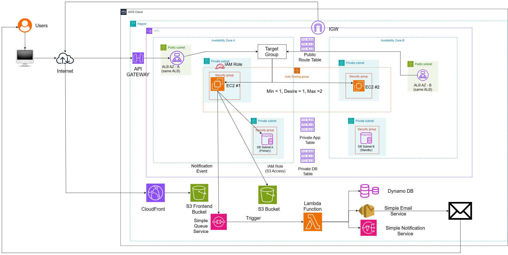

# Moldy Market — Kiến trúc triển khai hệ thống

---

## 1. Tổng quan

Hệ thống Moldy Market được triển khai trên nền tảng Amazon Web Services (AWS) theo kiến trúc Modular Monolith kết hợp với các dịch vụ AWS Managed Services.

- Frontend được triển khai dưới dạng ứng dụng web tĩnh thông qua Amazon S3 và Amazon CloudFront. Backend được xây dựng bằng Spring Boot, đóng gói thành một ứng dụng duy nhất và triển khai trên các máy chủ Amazon EC2 được quản lý bởi Auto Scaling Group (ASG).
- Các request từ phía người dùng được tiếp nhận thông qua Amazon API Gateway, sau đó được chuyển tiếp đến Application Load Balancer (ALB). ALB phân phối request đến các EC2 instance thông qua Target Group.
- Dữ liệu nghiệp vụ được lưu trữ trên Amazon RDS for PostgreSQL, trong khi các file và hình ảnh được lưu trữ trên Amazon S3.
- Hệ thống thông báo được xử lý theo mô hình bất đồng bộ thông qua Amazon SQS, AWS Lambda, Amazon DynamoDB, Amazon SNS và Amazon SES.

---

## 2. Kiến trúc triển khai tổng thể

Kiến trúc triển khai của hệ thống được chia thành ba luồng chính:

### 2.1 Luồng Frontend

Người dùng -> Internet -> Amazon CloudFront -> Amazon S3 (Frontend Bucket)

Frontend được build thành các file tĩnh và lưu trữ trên S3. CloudFront đóng vai trò CDN (Content Delivery Network), phân phối các file frontend đến người dùng.
Người dùng không truy cập trực tiếp S3 trong luồng sử dụng thông thường mà truy cập thông qua CloudFront.

### 2.2. Luồng Backend API

Người dùng / Frontend -> Internet -> API Gateway -> ALB -> Target Group -> EC2 Instances (Spring Boot Application) ->RDS PostgreSQL

Frontend sau khi được tải về từ CloudFront sẽ gửi các request API đến API Gateway.
API Gateway đóng vai trò là điểm truy cập công khai cho các API của hệ thống. Request sau đó được chuyển đến Application Load Balancer.
ALB phân phối request đến các EC2 instance đang hoạt động và vượt qua health check của Target Group.

### 2.3 Luồng xử lý thông báo
Spring Boot
      ↓
     SQS
      ↓
    Lambda
 /        |     \
 ↓        ↓     ↓
DynamoDB SNS    SES
                 ↓
                Email

Các module nghiệp vụ trong backend phát sinh notification event sẽ gửi event đến Amazon SQS.

Lambda được kích hoạt để xử lý các message trong queue. Sau đó Lambda có thể:
- Lưu thông báo vào DynamoDB.
- Publish notification thông qua SNS.
- Gửi email thông qua SES.

Việc xử lý bất đồng bộ giúp tách quá trình gửi thông báo khỏi transaction nghiệp vụ chính.

---
## 3. AWS Region và Availability Zone

Hệ thống được triển khai trong một AWS Region và sử dụng hai Availability Zone nhằm tăng khả năng sẵn sàng của tầng ứng dụng và cơ sở dữ liệu.

Cấu trúc tổng thể:

AWS Cloud
├── AWS Region
├── Availability Zone A
└── Availability Zone B

Trong Region, hệ thống sử dụng một VPC bao gồm các subnet được phân chia theo chức năng:

VPC
│
├── Availability Zone A
│   ├── Public Subnet
│   ├── Private Application Subnet
│   └── Private Database Subnet
│
└── Availability Zone B
    ├── Public Subnet
    ├── Private Application Subnet
    └── Private Database Subnet

Việc phân tách subnet giúp cô lập các thành phần theo mức độ truy cập và vai trò trong hệ thống.

---

## 4. Amazon VPC

Amazon VPC được sử dụng để tạo mạng riêng cho các thành phần backend của hệ thống.

Các tài nguyên cần được bảo vệ như EC2 và RDS được đặt trong các private subnet, trong khi Application Load Balancer được đặt trong public subnet để tiếp nhận traffic từ Internet.

Kiến trúc mạng có dạng:
                    VPC
                     │
        ┌────────────┴────────────┐
        │                         │
      AZ-A                      AZ-B
        │                         │
   ┌────┴────┐               ┌────┴────┐
   │         │               │         │
Public    Private          Public    Private
Subnet    Subnets          Subnet    Subnets

API Gateway và CloudFront là các AWS Managed Services nằm ngoài VPC.

---

## 5. Internet Gateway

Internet Gateway (IGW) được gắn với VPC và cung cấp khả năng kết nối giữa VPC và Internet cho các tài nguyên trong public subnet.

Public subnet sử dụng route table với route mặc định:

Destination       Target
0.0.0.0/0         Internet Gateway

Application Load Balancer được triển khai trong các public subnet và có thể nhận request từ Internet.
Internet Gateway không kết nối trực tiếp với API Gateway. API Gateway là AWS Managed Service và không nằm bên trong VPC.
---
## 6. Frontend Deployment

Frontend của Moldy Market được triển khai độc lập với backend.
Kiến trúc:

Người dùng -> Internet -> CloudFront -> S3 Frontend Bucket

Frontend application sau khi build sẽ tạo ra các static assets như:
- index.html
- assets/
- js/
- css/

Các file này được lưu trữ trên một S3 bucket dành riêng cho frontend.
CloudFront được sử dụng để phân phối nội dung frontend đến người dùng thông qua mạng CDN.

S3 Frontend Bucket: Bucket này chỉ phục vụ cho việc lưu trữ và phân phối frontend static files.
Ví dụ:
moldy-market-frontend
├── index.html
├── assets/
├── js/
└── css/

Frontend bucket được tách biệt với bucket lưu trữ dữ liệu ứng dụng để đơn giản hóa việc quản lý quyền truy cập và lifecycle của dữ liệu.

---
## 7. API Gateway 

Amazon API Gateway đóng vai trò là điểm truy cập API công khai của hệ thống.
Luồng request: 
    Frontend -> API Gateway -> ALB -> EC2 Instances (Spring Boot Application)

API Gateway chịu trách nhiệm cho các chức năng ở lớp API Gateway như:
- Tiếp nhận request từ client.
- Routing request.
- HTTPS/TLS endpoint.
- Throttling và rate limiting.
- Logging và monitoring.

API Gateway không chứa business logic của Moldy Market. Business logic được xử lý bên trong Spring Boot backend.

Các nhóm API có thể được định tuyến đến cùng backend:
/api/auth/**
/api/users/**
/api/listings/**
/api/orders/**
/api/payments/**
/api/shipping/**
/api/appraisals/**
/api/admin/**

Do backend sử dụng kiến trúc Modular Monolith nên các module trên cùng được đóng gói trong một Spring Boot application.

---
### 8. Application Load Balancer
Application Load Balancer được sử dụng để phân phối request đến các EC2 instance.

API Gateway
    ↓
   ALB
    ↓
Target Group
/       \
EC2 #1   EC2 #2

ALB được triển khai trên hai Availability Zone.

Hai biểu diễn ALB trong diagram tương ứng với cùng một Application Load Balancer logic hoạt động trên nhiều Availability Zone, không phải hai ALB độc lập.

ALB sử dụng Target Group để quản lý các EC2 instance nhận traffic.

Target Group thực hiện health check đối với các instance. Những instance không vượt qua health check sẽ không được ALB tiếp tục chuyển request đến.

---

## 9. Auto Scaling Group
Các EC2 instance được quản lý bởi Auto Scaling Group.
Cấu hình ban đầu:
- Minimum Capacity = 1
- Desired Capacity = 1
- Maximum Capacity = 2

Ở trạng thái tải bình thường:
ASG -> EC2 #1

Khi hệ thống đạt điều kiện scaling được cấu hình, ASG có thể khởi tạo thêm EC2 instance:
ASG
├── EC2 #1
└── EC2 #2

EC2 instance mới sau khi được khởi tạo và vượt qua health check sẽ được Target Group đưa vào danh sách các instance có thể nhận traffic.
Mỗi EC2 instance chạy cùng một Spring Boot application:
- EC2 #1 → moldy-market-backend.jar
- EC2 #2 → moldy-market-backend.jar
Do đó việc scale không yêu cầu tách các module backend thành các service độc lập.
---
## 10. Backend Application
Backend được triển khai theo kiến trúc Modular Monolith.
Một Spring Boot application bao gồm các module:
Backend
├── Auth
├── User
├── Listing
├── Store
├── Offer
├── Order
├── Payment
├── Escrow
├── Shipping
├── Wallet
├── Review
├── Voucher
├── Notification
├── Appraiser
├── Pricing
└── Admin
Các module được đóng gói thành một artifact: moldy-market-backend.jar
Artifact này được triển khai trên các EC2 instance thuộc Auto Scaling Group.
---
## 11. Amazon RDS for PostgreSQL
Amazon RDS for PostgreSQL được sử dụng làm cơ sở dữ liệu quan hệ chính của hệ thống.
RDS được đặt trong các Private Database Subnet và không được truy cập trực tiếp từ Internet.

Các dữ liệu nghiệp vụ chính bao gồm:
- Người dùng.
- Sản phẩm/listing.
- Cửa hàng.
- Offer.
- Order.
- Payment.
- Escrow.
- Shipping.
- Wallet.
- Review.
- Voucher.
- Appraisal.
Các dữ liệu nghiệp vụ khác.

Mô hình triển khai Multi-AZ:
Private DB Subnet A
        │
RDS Primary
        │
        │ Replication
        ▼
Private DB Subnet B
        │
RDS Standby

Application layer chỉ được phép kết nối đến RDS thông qua security rule được cấu hình cho application security group.

---
## 12. Amazon S3 - Application Assets

Ngoài S3 bucket dành cho frontend, hệ thống sử dụng một S3 bucket riêng để lưu trữ các file được upload trong quá trình sử dụng ứng dụng.

EC2 / Spring Boot -> S3 Application Assets

Bucket có thể được tổ chức theo nhóm:
moldy-market-assets
├── listings/
├── users/
└── appraisals/

Các file như hình ảnh listing hoặc hình ảnh phục vụ appraisal được lưu trên S3 thay vì lưu trực tiếp dưới dạng binary trong PostgreSQL.

Database chỉ lưu thông tin tham chiếu, ví dụ: imageKey = listings/123/main.jpg
Backend sử dụng IAM Role để truy cập S3 thay vì lưu AWS access key trực tiếp trong source code.
---
## 13. Notification Architecture
Hệ thống notification được thiết kế theo mô hình xử lý bất đồng bộ.

Business Module
        ↓
Notification Publisher
        ↓
        SQS
        ↓
        Lambda
    /       |   \
   ↓        ↓    ↓
DynamoDB    SNS  SES
                  ↓
                Email

Ví dụ khi một payment được hoàn thành:
Payment Service -> PaymentCompleted Event -> SQS -> Lambda -> Notification

Business transaction không cần trực tiếp thực hiện toàn bộ quá trình gửi notification.

---
## 14. Amazon SQS
Amazon SQS được sử dụng làm message queue cho notification event.
Backend publish event vào queue:

Spring Boot -> SQS Queue
SQS đóng vai trò trung gian giữa business application và notification worker.

Cách tiếp cận này cho phép:
- Xử lý notification bất đồng bộ.
- Giảm coupling giữa business module và notification processing.
- Hỗ trợ retry khi xử lý thất bại.
- Không làm business transaction phải chờ quá trình gửi notification hoàn tất.

---
## 15. AWS Lambda
AWS Lambda đóng vai trò notification worker.
Lambda được kích hoạt khi có message mới trong SQS.
Quy trình:
SQS Message
    ↓
Lambda
    ↓
Process Event
├── DynamoDB
├── SNS
└── SES
Lambda được triển khai độc lập với Spring Boot backend và có lifecycle/deployment riêng.

---
## 16. Amazon DynamoDB
DynamoDB được sử dụng để lưu trữ các notification phục vụ việc hiển thị trong ứng dụng.
Ví dụ một notification record gồm các fields:
Notification
- notificationId
- userId
- eventType
- title
- content
- referenceId
- isRead
- createdAt

Frontend không truy cập trực tiếp DynamoDB.
Thay vào đó:
Frontend -> Backend API -> DynamoDB

Backend xác định user hiện tại và truy vấn các notification tương ứng.

---
## 17. Amazon SNS
Amazon SNS được sử dụng cho cơ chế publish/subscribe trong notification architecture.
Lambda có thể publish event đến SNS Topic:

  Lambda
    ↓
SNS Topic
├── Subscriber 1
├── Subscriber 2
└── Subscriber 3

Cách thiết kế này cho phép hệ thống mở rộng thêm các notification channel hoặc consumer khác mà không cần thay đổi trực tiếp business module tạo ra event.

---
## 18. Amazon SES
Amazon SES được sử dụng để gửi email notification.

Lambda -> SES -> User Email

Lambda chịu trách nhiệm xác định loại notification và nội dung email, trong khi SES đảm nhiệm việc gửi email.

Các trường hợp sử dụng có thể bao gồm:
- Xác nhận đăng ký.
- Thông báo thanh toán.
- Thông báo trạng thái đơn hàng.
- Thông báo appraisal.
- Các thông báo nghiệp vụ khác.

---

## 19. Security Architecture
Hệ thống áp dụng nhiều lớp bảo vệ ở cả network layer và application layer.

### 19.1. Network isolation
Luồng truy cập chính:

Internet -> API Gateway -> ALB -> Private EC2 -> Private RDS

EC2 và RDS không được expose trực tiếp ra Internet.

### 19.2. Security Groups
Các security group được tổ chức theo dependency:

ALB Security Group -> EC2 Security Group -> RDS Security Group

RDS chỉ cho phép kết nối PostgreSQL từ application layer.

### 19.3. IAM
IAM Role được sử dụng cho các resource cần truy cập AWS services.
Ví dụ:
EC2 IAM Role : S3 + SQS
Lambda IAM Role : DynamoDB + SNS + SES
Không lưu AWS access key trực tiếp trong source code hoặc application configuration.
