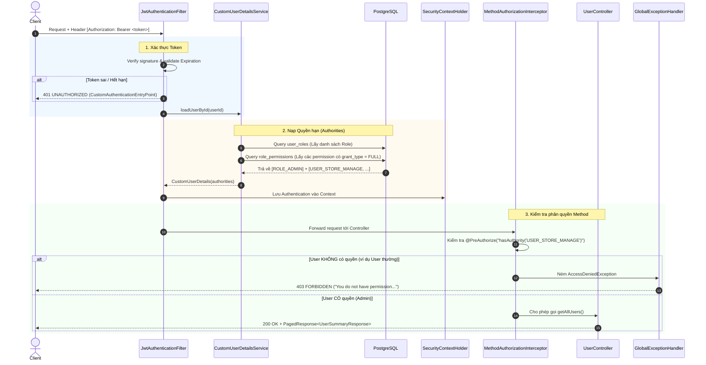

# MoldyMarket — Kiến trúc & Cơ chế Phân quyền (RBAC Authorization)

> **Tài liệu kỹ thuật nội bộ**  
> **Chủ đề**: Role-Based Access Control (RBAC) & Permission-based Security  
> **Dự án**: MoldyMarket Backend (Spring Boot 4.1 / Spring Security 7.x / PostgreSQL)  

---

## 1. Triết lý thiết kế (Design Philosophy)

Hệ thống phân quyền của MoldyMarket được thiết kế theo mô hình **RBAC nâng cao (Role-Based Access Control kết hợp Granular Permissions)** thay vì chỉ kiểm tra Role đơn giản.

```
┌─────────────────────────────────────────────────────────────┐
│                       NGƯỜI DÙNG                            │
│                  (gắn với 1 hoặc nhiều)                     │
└──────────────────────────────┬──────────────────────────────┘
                               ▼
┌─────────────────────────────────────────────────────────────┐
│                          ROLES                              │
│       USER · APPRAISER · STAFF · ADMIN · OWNER             │
│                  (gắn với 1 hoặc nhiều)                     │
└──────────────────────────────┬──────────────────────────────┘
                               ▼
┌─────────────────────────────────────────────────────────────┐
│                       PERMISSIONS                           │
│     PROFILE_MANAGE · USER_STORE_MANAGE · ORDER_PAY...       │
│                  (bảo vệ trực tiếp Endpoint)                │
└──────────────────────────────┬──────────────────────────────┘
```

### Tại sao không dùng `@IsAdmin` hay chỉ check cứng Role?
1. **Nguyên tắc quyền tối thiểu (Least Privilege):** Admin không phải là thượng đế. Admin có quyền khóa tài khoản (`USER_STORE_MANAGE`), nhưng **không** được quyền tự ý rút tiền ví user (`WALLET_WITHDRAW`) hay tự tiện thanh toán đơn hàng (`ORDER_PAY`).
2. **Khả năng mở rộng không sửa code (Decoupling):** Nếu sau này tuyển nhân viên Chăm sóc khách hàng (`SUPPORT_STAFF`), ta chỉ cần cấp quyền `USER_STORE_MANAGE` trong Database mà **không cần sửa lại bất kỳ dòng code Controller nào**.
3. **Phân loại GrantType:**
   - `FULL`: Có Role là nghiễm nhiên có quyền (Spring Security kiểm tra tự động).
   - `CONDITIONAL`: Quyền kèm điều kiện nghiệp vụ (kiểm tra thêm ở tầng Service, ví dụ: điểm uy tín, quyền sở hữu resource).
   - `DELEGATED`: Quyền ủy quyền (Store Owner cấp nhóm quyền cho Store Staff).

---

## 2. Cấu trúc Database & Model quan hệ

Hệ thống sử dụng 4 bảng liên kết trong PostgreSQL:

```
[users] ──< [user_roles] >── [roles] ──< [role_permissions] >── [permissions]
```

### 2.1 Bảng `permissions`
Lưu trữ danh mục tất cả hành động được định nghĩa trong hệ thống (chuẩn hóa theo module M2–M9 từ `MoldyMarket_Permission_Table.md`).
* `id` (UUID, PK)
* `code` (VARCHAR, UNIQUE): Ví dụ `PROFILE_MANAGE`, `USER_STORE_MANAGE`, `PRODUCT_CREATE`...
* `description` (VARCHAR): Mô tả quyền.

### 2.2 Bảng `roles`
Lưu trữ 5 role nền tảng:
* `USER`: Người dùng thông thường (mặc định khi đăng ký).
* `APPRAISER`: Thẩm định viên sản phẩm.
* `STAFF`: Nhân viên cửa hàng.
* `ADMIN`: Quản trị viên hệ thống.
* `OWNER`: Chủ gian hàng.

### 2.3 Bảng `role_permissions`
Bảng trung gian liên kết Role với Permission:
* `role_id` (UUID, FK $\rightarrow$ `roles.id`)
* `permission_id` (UUID, FK $\rightarrow$ `permissions.id`)
* `grant_type` (VARCHAR): `FULL`, `CONDITIONAL`, `DELEGATED`.
* Constraint: Unique `(role_id, permission_id)`.

### 2.4 Bảng `user_roles`
Gán user với role tương ứng (hỗ trợ 1 user có nhiều role):
* `user_id` (UUID, FK $\rightarrow$ `users.id`)
* `role_id` (UUID, FK $\rightarrow$ `roles.id`)
* `store_id` (UUID, NULLABLE): Áp dụng cho ngữ cảnh Store Owner / Staff.

---

## 3. Luồng hoạt động chi tiết (End-to-End Flow)

Khi một client gửi request tới một API được bảo vệ (ví dụ: `GET /api/v1/users`):



---

## 4. Các thành phần & Hàm xử lý tiêu biểu

### 4.1 Khởi tạo dữ liệu tự động (`RoleInitializer` & `PermissionInitializer`)

Để đảm bảo database luôn sẵn sàng khi chạy app mới, 2 seeder chạy tuần tự lúc startup:

1. **`RoleInitializer` (chạy với `@Order(1)`):**
   * Kiểm tra và tạo 5 roles mặc định nếu chưa tồn tại.
   * Khởi tạo tài khoản **System Admin** mặc định từ biến môi trường (`adminProperties`).
2. **`PermissionInitializer` (chạy với `@Order(2)`):**
   * Duyệt `ALL_PERMISSIONS` $\rightarrow$ nạp toàn bộ danh mục quyền vào bảng `permissions`.
   * Duyệt `ROLE_FULL_PERMISSIONS` $\rightarrow$ tạo liên kết mapping giữa các Role và Permission có `GrantType.FULL` trong bảng `role_permissions`.

---

### 4.2 Nạp quyền động mỗi request (`CustomUserDetailsService`)

Hàm trọng tâm: `buildUserDetails(User user)`:

```java
private CustomUserDetails buildUserDetails(User user) {
    // 1. Lấy tất cả user_roles của người dùng từ DB
    List<UserRole> userRoles = userRoleRepository.findAllByUserId(user.getId());

    // 2. Map các Role thành GrantedAuthority tiền tố ROLE_
    List<SimpleGrantedAuthority> authorities = new ArrayList<>(
            userRoles.stream()
                    .map(UserRole::getRole)
                    .map(Role::getName)
                    .map(roleName -> new SimpleGrantedAuthority("ROLE_" + roleName))
                    .toList()
    );

    // 3. Thu thập danh sách ID của các Role
    List<UUID> roleIds = userRoles.stream()
            .map(ur -> ur.getRole().getId())
            .toList();

    // 4. Truy vấn JPQL tối ưu: nạp tất cả permission code của các Role đó
    if (!roleIds.isEmpty()) {
        List<SimpleGrantedAuthority> permissionAuthorities = rolePermissionRepository
                .findPermissionCodesByRoleIdsAndGrantType(roleIds, GrantType.FULL)
                .stream()
                .distinct()
                .map(SimpleGrantedAuthority::new)
                .toList();

        authorities.addAll(permissionAuthorities);
    }

    return new CustomUserDetails(user, authorities);
}
```

> **Điểm ưu việt:** 
> - Role và Permission cùng nằm trong tập `authorities`.
> - `hasRole('ADMIN')` $\rightarrow$ tự tìm `ROLE_ADMIN`.
> - `hasAuthority('USER_STORE_MANAGE')` $\rightarrow$ tìm `USER_STORE_MANAGE`.
> - Cả hai cơ chế hoạt động song song hoàn hảo.

---

### 4.3 Truy vấn nạp quyền tối ưu (`RolePermissionRepository`)

Để tránh lỗi `N+1 query`, phương thức dùng 1 câu JPQL duy nhất để fetch toàn bộ mã quyền:

```java
@Query("""
    SELECT rp.permission.code
    FROM RolePermission rp
    WHERE rp.role.id IN :roleIds
      AND rp.grantType = :grantType
""")
List<String> findPermissionCodesByRoleIdsAndGrantType(
        @Param("roleIds") List<UUID> roleIds,
        @Param("grantType") GrantType grantType
);
```

---

### 4.4 Bảo vệ Endpoint ở tầng Controller (`UserController`)

Sử dụng `@PreAuthorize` kết hợp hằng số từ `PermissionConstants`:

```java
// Bất kỳ ai đăng nhập đều xem được hồ sơ chính mình
@GetMapping("/me")
public ResponseEntity<?> getMyProfile(Authentication authentication) { ... }

// Chỉ tài khoản có quyền PROFILE_MANAGE (USER, OWNER, APPRAISER) mới được cập nhật
@PreAuthorize("hasAuthority('" + PermissionConstants.PROFILE_MANAGE + "')")
@PutMapping("/me")
public ResponseEntity<?> updateMyProfile(...) { ... }

// Chỉ tài khoản có quyền USER_STORE_MANAGE (ADMIN) mới được xem danh sách hoặc khóa user
@PreAuthorize("hasAuthority('" + PermissionConstants.USER_STORE_MANAGE + "')")
@GetMapping
public ResponseEntity<?> getAllUsers(...) { ... }
```

---

### 4.5 Xử lý lỗi bảo mật tập trung (`GlobalExceptionHandler`)

Bắt lỗi khi người dùng không đủ quyền truy cập:

```java
@ExceptionHandler(AccessDeniedException.class)
public ResponseEntity<ApiResponse<ApiError>> handleAccessDeniedException(
        AccessDeniedException exception,
        HttpServletRequest request
) {
    ApiError error = ApiError.of(request.getRequestURI());

    ApiResponse<ApiError> response = ApiResponse.failure(
            ErrorCode.FORBIDDEN.name(),
            ErrorCode.FORBIDDEN.getMessage(),
            error
    );

    return ResponseEntity
            .status(ErrorCode.FORBIDDEN.getHttpStatus()) // 403 FORBIDDEN
            .body(response);
}
```

> **Lưu ý quan trọng**: Phải import `org.springframework.security.access.AccessDeniedException`, không được dùng `java.nio.file.AccessDeniedException`.

---

## 5. Bảng ma trận mã trạng thái HTTP

| Trạng thái HTTP | Mã lỗi trả về | Nguyên nhân | Giải pháp cho Client |
|:---|:---|:---|:---|
| **`401 UNAUTHORIZED`** | `UNAUTHENTICATED` | Token thiếu, sai định dạng, bị chỉnh sửa hoặc đã hết hạn 15 phút. | Gửi request refresh token (`POST /api/v1/auth/refresh`) hoặc đăng nhập lại. |
| **`403 FORBIDDEN`** | `FORBIDDEN` | Đã đăng nhập hợp lệ nhưng Role của tài khoản không sở hữu Permission yêu cầu. | Dùng tài khoản có quyền tương ứng (ví dụ Admin). |
| **`403 FORBIDDEN`** | `ACCOUNT_DISABLED` | Tài khoản đang ở trạng thái `PENDING_VERIFICATION`. | Kích hoạt/xác thực email tài khoản. |
| **`403 FORBIDDEN`** | `ACCOUNT_LOCKED` | Tài khoản đã bị Admin khóa (`LOCKED`). | Liên hệ ban quản trị. |
| **`200 OK`** | *(Thành công)* | Đầy đủ authentication và authorization. | Nhận dữ liệu response. |

---

## 6. Hướng dẫn cho Team khi thêm API mới

Khi viết chức năng mới (Store, Product, Order...):

1. **Tra cứu Permission Code** trong `PermissionConstants.java` (ví dụ: `PRODUCT_CREATE`, `ORDER_PROCESS`).
2. **Gắn Annotation bảo vệ** trên Controller:
   ```java
   @PreAuthorize("hasAuthority('" + PermissionConstants.PRODUCT_CREATE + "')")
   @PostMapping
   public ResponseEntity<?> createProduct(...) { ... }
   ```
3. **Nếu cần cấp quyền cho thêm Role:**
   - Chỉ cần thêm 1 dòng dữ liệu vào bảng `role_permissions` trong Database hoặc bổ sung vào `ROLE_FULL_PERMISSIONS` trong `PermissionInitializer`.
   - **Tuyệt đối không sửa code Controller.**
